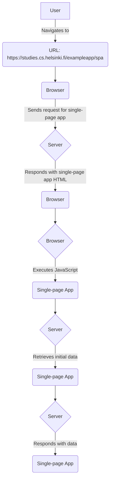

```mermaid
graph TD;
    A[User] -->|Navigates to| B(URL: https://studies.cs.helsinki.fi/exampleapp/spa);
    B --> C(Browser);
    C -->|Sends request for single-page app| D{Server};
    D -->|Responds with single-page app HTML| E(Browser);
    E --> F{Browser};
    F -->|Executes JavaScript| G(Single-page App);
    G --> H{Server};
    H -->|Retrieves initial data| I(Single-page App);
    I --> J{Server};
    J -->|Responds with data| K(Single-page App);
```
