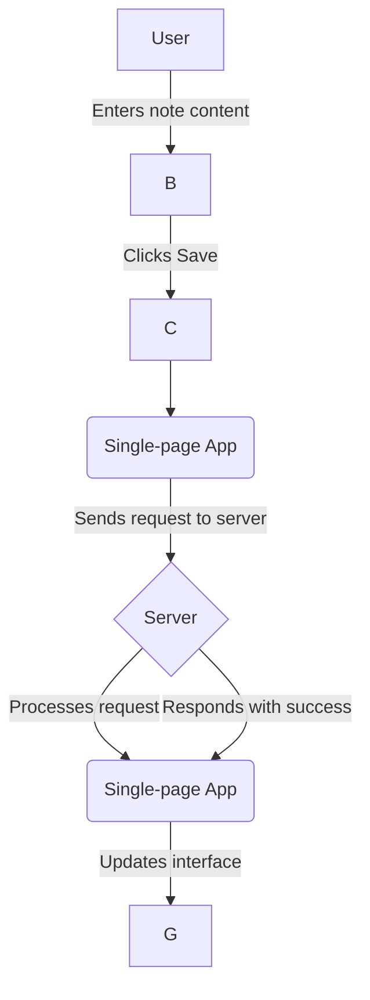

```mermaid
graph TD;
    A[User] -->|Enters note content| B;
    B -->|Clicks Save| C;
    C --> D(Single-page App);
    D -->|Sends request to server| E{Server};
    E -->|Processes request| F(Single-page App);
    F -->|Updates interface| G;
    E -->|Responds with success| F;
```